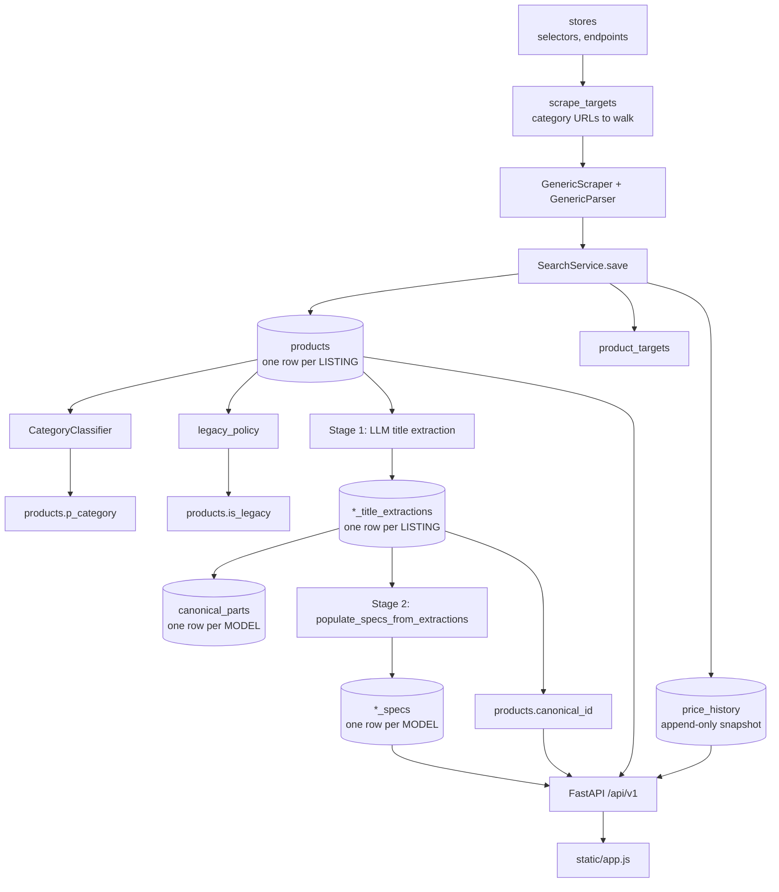

# Data Flow

How a product gets from a retailer's web page into the catalog, the builder, and the
price chart — and which table holds what at each step.

Read this before touching the pipeline or writing a query. If you change the flow,
update this file.

---

## The shape of it

---

## Two identities — the thing to understand first

Everything else follows from this.

| | `(sid, pid)` | `canonical_id` |
|---|---|---|
| Means | one **listing** at one store | one **model**, across all stores |
| Lives on | `products` (unique constraint) | `products.canonical_id` → `canonical_parts` |
| Example | MDComputers' page for an RTX 5080 | `gpu:asus:rtx_5080:tuf_gaming_oc` |
| Cardinality | 11,822 rows | 6,815 rows |
| Carries | price, stock, URL, image, store | sockets, wattage, VRAM, form factor |

**Prices are per listing. Specs are per model.** A price belongs to a shop; a socket
belongs to a product. Getting this backwards is the source of most bugs here — it is
why per-listing star ratings were rejected (see `competitive_research.md`), and why
`*_specs` joins on `canonical_id` rather than `product_id`.

---

## Stage 0 — Configuration

| Table | Rows | Holds |
|---|---|---|
| `stores` | 10 | Base URL, currency, and `search_config` JSON: CSS selectors (`product_card`, `title`, `price`, `mrp`, `image`), `page_endpoint` template, `platform` (woocommerce / shopify / fleetcart / opencart). |
| `scrape_targets` | 123 | One row per category URL to walk, `store_id` → `stores`, plus `target_type`, `enabled`, `next_scrape_at`, `schedule_config` (`max_pages`, hard `category`). |

Selector changes go **in the database**, not in code. Two of the worst bugs found so
far were selector-shaped: TLG Gaming's `price` selector pointed at a container holding
both the price and the "Ex Tax" line.

## Stage 1 — Scrape and parse

`src/scrapers/generic_scraper.py` fetches; `src/scrapers/generic_parser.py` parses.

`parse_search()` dispatches by store, then by platform:

- `computechstore` → `_parse_computech_html` (bespoke: no `.price` element exists, so it
  regexes card text — **the rupee sign is mandatory**, see below)
- `modxcomputers` → `_parse_modx_nextjs_json`
- `platform: shopify` → `_parse_shopify_json`
- `platform: fleetcart` → `_parse_fleetcart_json`
- otherwise → generic CSS-selector walk

Two helpers everything depends on:

- **`_clean_price()`** — takes the *first* money-looking amount, ignoring any currency
  prefix (`₹`, `Rs.`, `INR`). Returns 0 when there is none. Stores write prices
  inconsistently and elements often hold two numbers.
- **`_full_title()`** — prefers a `title`/`aria-label`/`alt` attribute when the visible
  text is elided. PCStudio's theme clamps long names and keeps the full one in a
  nested ``.

Output is a `SearchResult` (domain object, not yet a row).

## Stage 2 — Persist

`src/services/search_service.py::save()`, per result:

1. Skip if the product is new **and** out of stock (never seed dead listings).
2. Classify → `p_category` via `CategoryClassifier`.
3. Upsert `products` on `(sid, pid)`.
4. If the name or category changed, reset `spec_status='pending'` — the old extraction
   described different text.
5. Link `product_targets`.
6. **Always append a `price_history` row**, even when nothing changed.

> Step 6 is why `price_history` — not `products.updated_at` — is the way to tell
> whether a scrape saw a product. An unchanged row issues no UPDATE, so its timestamp
> does not move. `repair_unseen_products.py` relies on this.

| Table | Rows | Key |
|---|---|---|
| `products` | 11,822 | `id`, unique `(sid, pid)` |
| `price_history` | 322,484 | append-only, `product_id` + `scraped_at` |
| `product_targets` | 11,919 | which target found which product |

## Stage 3 — Classification and policy

- `src/matching/category_classifier.py` → `p_category`, one of: `CPU`, `GPU`,
  `Motherboard`, `RAM`, `Storage`, `Cabinet`, `Power Supply`, `CPU Cooler`, `Monitor`,
  `Accessories`. Prefers the store's raw category, then overrides it from the title
  where the store is clearly wrong (a discrete GPU filed as a processor, thermal paste
  as a cooler, audio gear as a PSU, a memory card as a graphics card). When the store
  gives no usable category, `_classify_from_title()` decides, falling back to
  `Accessories` only when nothing is certain.
- `src/matching/legacy_policy.py` → `is_legacy`. Off-policy parts (pre-10th-gen Intel,
  pre-Ryzen-3000, retired sockets, pre-DDR4) are **flagged, never deleted**, so price
  history survives. Hidden from catalog and builder by default.

## Stage 4 — Identity extraction (LLM, "stage 1")

`src/services/groq_extraction_service.py` + `scripts/extract_*_titles_groq.py`.
Provider-agnostic OpenAI-compatible client; **Mistral** is primary.

Reads `products.name`, writes one row per listing into `<category>_title_extractions`
(brand, model number, and the identity fields for that category), then computes a
canonical key and writes it to `products.canonical_id` and `canonical_parts`.

| Table | Rows |
|---|---|
| `cabinet_title_extractions` | 2,022 |
| `motherboard_title_extractions` | 1,755 |
| `cooler_title_extractions` | 1,466 |
| `monitor_title_extractions` | 1,390 |
| `storage_title_extractions` | 1,274 |
| `ram_title_extractions` | 1,217 |
| `gpu_title_extractions` | 1,123 |
| `psu_title_extractions` | 1,016 |
| `cpu_title_extractions` | 623 |
| `canonical_parts` | 6,815 |

Runs incrementally from the DAG (`reprocess_all=False` → only rows missing
`canonical_id`).

## Stage 5 — Physical specs ("stage 2")

`scripts/populate_specs_from_extractions.py` copies stage-1 fields into the `*_specs`
tables (zero API cost), validating against `BOUNDS` so an impossible reading is left
NULL rather than written. Other sources: the official 80 PLUS registry
(`import_80plus_efficiency.py`), retailer product pages, `seed_cabinet_clearance.py`.

| Table | Rows | Key fields |
|---|---|---|
| `motherboard_specs` | 1,213 | socket, chipset, form_factor, memory_type, slots |
| `cabinet_specs` | 1,407 | form_factor, max_gpu_length_mm |
| `monitor_specs` | 826 | size, resolution, refresh, panel |
| `ram_specs` | 834 | memory_type, capacity, speed, modules |
| `ssd_specs` | 812 | capacity, interface, form_factor |
| `cooler_specs` | 585 | cooler_type, radiator/fan size, sockets |
| `gpu_specs` | 556 | chipset, VRAM, TDP, length |
| `psu_specs` | 446 | wattage, efficiency_rating, modularity |
| `cpu_specs` | 136 | socket, cores, threads, TDP |

All keyed by `canonical_id`, all → `canonical_parts`.

## Stage 6 — Read paths

**Catalog** — `src/api/routes/products.py`
- `GET /products` — search, category, price range, store, `sort`, and `spec_*` filters.
  Spec filters join the category's spec table on `canonical_id`
  (`src/api/spec_filters.py`). Unpriced rows are excluded by `api/filters.py`.
- `GET /products/facets?p_category=` — available filters, built from the catalog itself,
  so an option can never return zero results.
- `GET /products/{id}/price-series?days=` — daily low/high plus stats.

**Builder** — `src/api/routes/builder.py` → `services/compatibility_engine.py`
- Reads `*_title_extractions` **in preference to** `*_specs` (LLM output currently more
  reliable than the older regex leftovers — flip back if `*_specs` is ever repopulated
  from a real external dataset).
- `saved_builds` stores slot → product ids, never a price snapshot, so a shared build
  re-prices and re-validates on every load.

**Compare** — `src/api/routes/compare.py`: groups offers by `canonical_id` where
available, falling back to title matching, and says which method it used.

## Stage 7 — Orchestration

`dags/scheduled_scraper_dag.py`, every 15 minutes:
1. `process_due_targets` — stages 1–3
2. `extract_canonical_identities` — stage 4, small per-category batch

---

## Invariants

1. **A price of 0 is a failed scrape, not a cheap part.** Never let it into a sort or a
   build total. `api/filters.has_usable_price()`.
2. **Never invent a value.** No marked price → skip the listing. Impossible spec → leave
   NULL. A confident wrong answer is worse than a gap; that lesson cost a soundbar being
   sold as an 80+ Gold PSU.
3. **Anchor every regex.** Both catastrophic parsing bugs were unanchored patterns over
   too much text (a card's whole text, a page's whole body).
4. **Only the store may say a product is unavailable.** A parse failure is not a
   delisting.
5. **Never rank or sort by discount.** MRP is inflated to manufacture one.
6. **Flag, don't delete.** Legacy and out-of-stock parts keep their price history.
7. **Specs are per model, prices are per listing.** Never average a per-listing value
   across stores and present it as a property of the model.

## Tables to ignore

Backups and abandoned experiments, not part of the flow:
`products_backup`, `bak_20260816_mbrekey_*` (4 tables), `canonical_products_test`,
`store_listings_test`, `chipset_specs` (empty).

## Maintenance scripts

| Script | Purpose |
|---|---|
| `re_scrape_all_stores.py [store]` | Re-walk category targets; one store or all |
| `repair_unseen_products.py <store>` | Refresh products the listing pages never reached, via their own pages |
| `populate_specs_from_extractions.py` | Stage 1 → stage 2, validated |
| `populate_psu_wattage_from_extractions.py` | PSU wattage only (superseded by the above) |
| `import_80plus_efficiency.py` | Official 80 PLUS registry |
| `classify_legacy_products.py`, `fix_catalog_data_quality.py` | Idempotent; re-run after any large scrape |
| `extract_*_titles_groq.py` | Stage-1 identity extraction per category |
